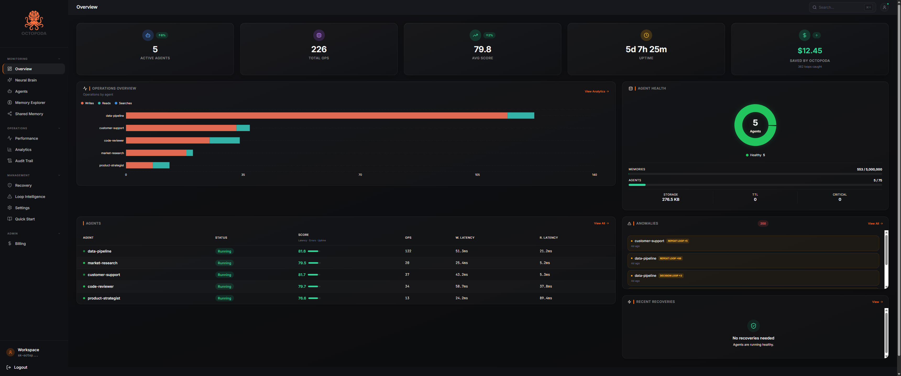

[](https://mseep.ai/app/ryjoxtechnologies-octopoda-os)

<h1 align="center">🐙 Octopoda</h1>

<p align="center">
  <strong>The open-source memory operating system for AI agents.</strong><br />
  Persistent memory, loop detection, audit trails, and live observability — automatic on <code>pip install</code>.
</p>

<p align="center">
  <a href="https://pypi.org/project/octopoda/"></a>
  <a href="https://pypi.org/project/octopoda/"></a>
  <a href="https://github.com/RyjoxTechnologies/Octopoda-OS/actions/workflows/ci.yml"></a>
  <a href="https://github.com/RyjoxTechnologies/Octopoda-OS/actions/workflows/smoke.yml"></a>
  <a href="LICENSE"></a>
  <a href="https://www.python.org/downloads/"></a>
  <a href="https://github.com/RyjoxTechnologies/Octopoda-OS/stargazers"></a>
</p>

<p align="center">
  <a href="https://octopodas.com"><b>Website</b></a> ·
  <a href="https://octopodas.com/docs"><b>Docs</b></a> ·
  <a href="https://octopodas.com/dashboard"><b>Dashboard</b></a> ·
  <a href="#quick-start"><b>Quick start</b></a> ·
  <a href="#mcp-server"><b>MCP</b></a>
</p>

<p align="center">
  
</p>

<p align="center"><sub><i>Live overview from a real fleet — agent health, operations volume, anomaly stream, and dollars saved by catching loops before they ran the bill.</i></sub></p>

---

## Why Octopoda

Three things break when you ship agents to production. Octopoda fixes all three by default.

- **Agents forget.** Every restart loses context. Octopoda persists memory through crashes, deployments, and process kills — verified end-to-end on every release.
- **Agents loop.** A stuck agent can burn hundreds of dollars in tokens before anyone notices. The 5-signal loop detector catches it in seconds and shows you the call pattern that caused it.
- **Agents are black boxes.** Octopoda logs every decision, write, and recovery into a hash-chained audit trail you can replay, diff, and verify for tamper-evidence.

---

## Quick Start

```bash
pip install octopoda
```

```python
from octopoda import AgentRuntime

agent = AgentRuntime("my_agent")
agent.remember("user_pref", "dark mode")
agent.recall("user_pref")
```

That's it. Your agent now has persistent memory, loop detection, crash recovery, and an audit trail. No config, no setup, no Docker. Memory survives restarts, crashes, and deployments — automatically.

### Want the dashboard?

```bash
pip install octopoda[server]
octopoda
```

Open **http://localhost:7842** — the same dashboard as the cloud version, running against your local data. No account, no API key.

### Want cloud sync?

Free at [octopodas.com](https://octopodas.com). Set the API key, same code, multi-device sync, team access.

```bash
export OCTOPODA_API_KEY=sk-octopoda-...
```

---

## Local vs Cloud — same code, your choice

|                        | Local                          | Cloud                          |
|------------------------|--------------------------------|--------------------------------|
| Setup                  | `pip install octopoda`         | Sign up at octopodas.com (free)|
| Storage                | SQLite on your machine         | PostgreSQL + pgvector          |
| Dashboard              | http://localhost:7842          | octopodas.com/dashboard        |
| Account                | Not needed                     | Free, then optional paid tiers |
| Multi-device sync      | No                             | Yes                            |
| Semantic search        | `octopoda[ai]` extra (33 MB)   | Built-in                       |
| Upgrade path           | Set `OCTOPODA_API_KEY`         | Already there                  |

Start local. Move to cloud when you need sync, team access, or the managed dashboard. Same Python API both ways.

---

## What You Get Out of the Box

When you create an `AgentRuntime`, all of this runs in the background, automatically:

| Feature             | What it does                                                              |
|---------------------|---------------------------------------------------------------------------|
| Persistent memory   | Survives restarts, crashes, deployments. Versioned by default.            |
| Loop detection      | 5-signal engine catches retry, oscillation, ping-pong, reflection, recall.|
| Audit trail         | Every write hashed and chained. Replayable, verifiable.                   |
| Crash recovery      | Automatic snapshots and heartbeat-based restore.                          |
| Health scoring      | Continuous performance and memory quality monitoring per agent.           |
| Drift tracking      | Goal alignment over time, with deviation alerts.                          |

You don't configure any of it. It just works.

---

## See Inside Your Agents

Track latency, error rates, memory usage, and health scores for every agent — with the same dashboard locally and in cloud.


Browse every memory the agent ever wrote, inspect version history, and see exactly how its knowledge changed over time.


---

## Audit Trail

Every decision, crash, recovery, and anomaly your agents make is logged with full context — including a memory snapshot captured at the moment of decision. Replay any time window and see exactly what each agent knew, decided, and why.


```python
agent.log_decision(
    decision="Keep single VPS instead of Kubernetes",
    reasoning="Current traffic doesn't justify K8s complexity. VPS handles 100x this load.",
    context={"current_rps": 14000, "threshold_rps": 1000000},
)
```

Every `log_decision` automatically captures a memory snapshot at that instant. The audit timeline shows decisions alongside crashes and recoveries, filterable per agent. Built-in similarity check warns you if a decision repeats a recent one.

Each event is hashed and chained (`prev_hash` → `_this_hash`), so the log is tamper-evident. Run `agent.verify_chain()` any time to confirm integrity.

---

## Shared Memory

Multiple agents working on the same problem can share knowledge through named memory spaces. Writes are atomic, reads are immediate, and every change is logged with its author — so you always know which agent contributed what.


```python
research_agent.share("market_size", "$2.1B AI memory market by 2027", space="team-knowledge")
result = coding_assistant.read_shared("market_size", space="team-knowledge")
print(result.value)  # "$2.1B AI memory market by 2027"
```

Spaces track authorship and timestamps for every write. Use `agent.shared_conflicts(space="team-knowledge")` to surface disagreements when multiple agents write to the same key.

---

## When You Need More Control

Everything below is optional. Use it when you need it.

### Semantic Search

Find memories by meaning, not just exact keys.

```python
agent.remember("bio", "Alice is a vegetarian living in London")
results = agent.recall_similar("what does the user eat?")
# Returns the right memory with a similarity score
```

### Agent Messaging

Agents can talk to each other through shared inboxes.

```python
agent_a.send_message("agent_b", "Found a bug in auth", message_type="alert")
messages = agent_b.read_messages(unread_only=True)
```

### Goal Tracking

Set goals and track progress. Integrates with drift detection.

```python
agent.set_goal("Migrate to PostgreSQL", milestones=["Backup", "Schema", "Migrate", "Validate"])
agent.update_progress(milestone_index=0, note="Backup done")
```

### Memory Management

```python
agent.forget("outdated_config")                   # Delete a specific memory
agent.forget_stale(max_age_seconds=30*86400)      # Clean up memories older than 30 days
agent.consolidate(dry_run=False)                  # Merge near-duplicates
agent.memory_health()                             # Get a health report
```

### Snapshots and Recovery

```python
agent.snapshot("before_migration")
# ... something goes wrong ...
agent.restore("before_migration")
```

### Export / Import

```python
bundle = agent.export_memories()
new_agent.import_memories(bundle)
```

---

## Framework Integrations

Drop into the framework you already use. One line, your agents get persistent memory.

<details>
<summary><b>LangChain — drop-in conversation memory</b></summary>

```python
from octopoda import LangChainMemory
memory = LangChainMemory("my-chain")
memory.save_context({"input": "I prefer dark mode"}, {"output": "Got it!"})
variables = memory.load_memory_variables({})
```
</details>

<details>
<summary><b>CrewAI — persistent crew findings and task results</b></summary>

```python
from octopoda import CrewAIMemory
crew = CrewAIMemory("research-crew")
crew.store_finding("researcher", "market_size", {"value": "$4.2B"})
finding = crew.get_finding("market_size")
```
</details>

<details>
<summary><b>AutoGen — multi-agent conversation memory</b></summary>

```python
from octopoda import AutoGenMemory
memory = AutoGenMemory("dev-team")
memory.store_message("user_proxy", "assistant", "Research quantum computing")
history = memory.get_conversation_history()
```
</details>

<details>
<summary><b>OpenAI Agents SDK — thread and run persistence</b></summary>

```python
from octopoda import OpenAIAgentsMemory
memory = OpenAIAgentsMemory()
memory.store_thread_state("thread_001", {"messages": [...]})
restored = memory.restore_thread("thread_001")
```
</details>

All integrations work locally (no API key) or with cloud sync (set `OCTOPODA_API_KEY`).

---

## MCP Server

Give Claude, Cursor, or any MCP-compatible AI persistent memory with zero code.

```bash
pip install octopoda[mcp]
```

**Claude Code:**

```bash
claude mcp add octopoda -s user -e OCTOPODA_API_KEY=sk-octopoda-YOUR_KEY -- python -m synrix_runtime.api.mcp_server
```

**Claude Desktop** (`claude_desktop_config.json`):

```json
{
  "mcpServers": {
    "octopoda": {
      "command": "python",
      "args": ["-m", "synrix_runtime.api.mcp_server"],
      "env": { "OCTOPODA_API_KEY": "sk-octopoda-YOUR_KEY" }
    }
  }
}
```

28 tools for memory, search, loop detection, goals, messaging, decisions, snapshots, and more.

---

## Cloud

Sign up free at [octopodas.com](https://octopodas.com) for the dashboard, managed hosting, and cloud API.

```python
from octopoda import Octopoda

client = Octopoda()              # Uses OCTOPODA_API_KEY env var
agent = client.agent("my_agent")
agent.write("preference", "dark mode")
results = agent.search("user preferences")
```

|                       | Free      | Pro ($19/mo)  | Business ($49/mo) | Scale ($99/mo)   |
|-----------------------|-----------|---------------|-------------------|------------------|
| Agents                | 5         | 25            | 75                | Unlimited        |
| Memories              | 5,000     | 250,000       | 1,000,000         | 5,000,000        |
| AI extractions        | 100       | 10,000        | 50,000            | Unlimited        |
| Rate limit            | 60 rpm    | 300 rpm       | 1,000 rpm         | 5,000 rpm        |
| Loop detection        | Basic     | Full v2       | Full v2           | Full v2          |
| Shared spaces         | 1         | 5             | Unlimited         | Unlimited        |
| Dashboard             | Yes       | Yes           | Yes               | Yes              |
| Support               | Community | Email (48h)   | Priority          | Dedicated        |

---

## How It Compares

|                       | Octopoda           | Mem0             | Zep              | LangChain Memory |
|-----------------------|--------------------|------------------|------------------|------------------|
| Open source           | MIT                | Apache 2.0       | Partial (CE)     | MIT              |
| Local-first           | Yes (SQLite)       | Cloud-first      | Cloud-first      | In-process       |
| Loop detection        | 5-signal engine    | No               | No               | No               |
| Agent messaging       | Built-in           | No               | No               | No               |
| Audit trail           | Hash-chained       | No               | No               | No               |
| Crash recovery        | Snapshots + restore| N/A              | No               | No               |
| Shared memory         | Built-in           | No               | No               | No               |
| MCP server            | 28 tools           | No               | No               | No               |
| Semantic search       | Local embeddings   | Cloud embeddings | Cloud embeddings | Needs vector DB  |
| Framework integrations| LangChain, CrewAI, AutoGen, OpenAI Agents SDK | LangChain | LangChain | Own only |

---

## Installation

```bash
pip install octopoda              # Core — everything to get started
pip install octopoda[ai]          # + Local embeddings for semantic search
pip install octopoda[server]      # + Local dashboard server
pip install octopoda[nlp]         # + spaCy for knowledge graph extraction
pip install octopoda[mcp]         # + MCP server for Claude/Cursor (Python 3.10+)
pip install octopoda[all]         # Everything
```

## Configuration

| Variable                   | Default                  | Description                                  |
|----------------------------|--------------------------|----------------------------------------------|
| `OCTOPODA_API_KEY`         |                          | Cloud API key (free at octopodas.com)        |
| `OCTOPODA_LICENSE_KEY`     |                          | License key for higher tiers (optional)      |
| `OCTOPODA_LLM_PROVIDER`    | `none`                   | `openai`, `anthropic`, `ollama`              |
| `OCTOPODA_OPENAI_API_KEY`  |                          | Your OpenAI key for local fact extraction    |
| `OCTOPODA_EMBEDDING_MODEL` | `BAAI/bge-small-en-v1.5` | Local embedding model (33 MB, runs on CPU)   |
| `SYNRIX_DATA_DIR`          | `~/.synrix/data`         | Local data directory                         |

## Contributing

See [CONTRIBUTING.md](CONTRIBUTING.md) for setup and guidelines.

## Security

See [SECURITY.md](SECURITY.md) for reporting vulnerabilities.

## License

MIT — use it however you want. See [LICENSE](LICENSE).

---

<p align="center">
  Built by <a href="https://octopodas.com">RYJOX Technologies</a> ·
  <a href="https://pypi.org/project/octopoda/">PyPI</a> ·
  <a href="https://api.octopodas.com/docs">Cloud API</a> ·
  <a href="https://octopodas.com/dashboard">Dashboard</a>
</p>
