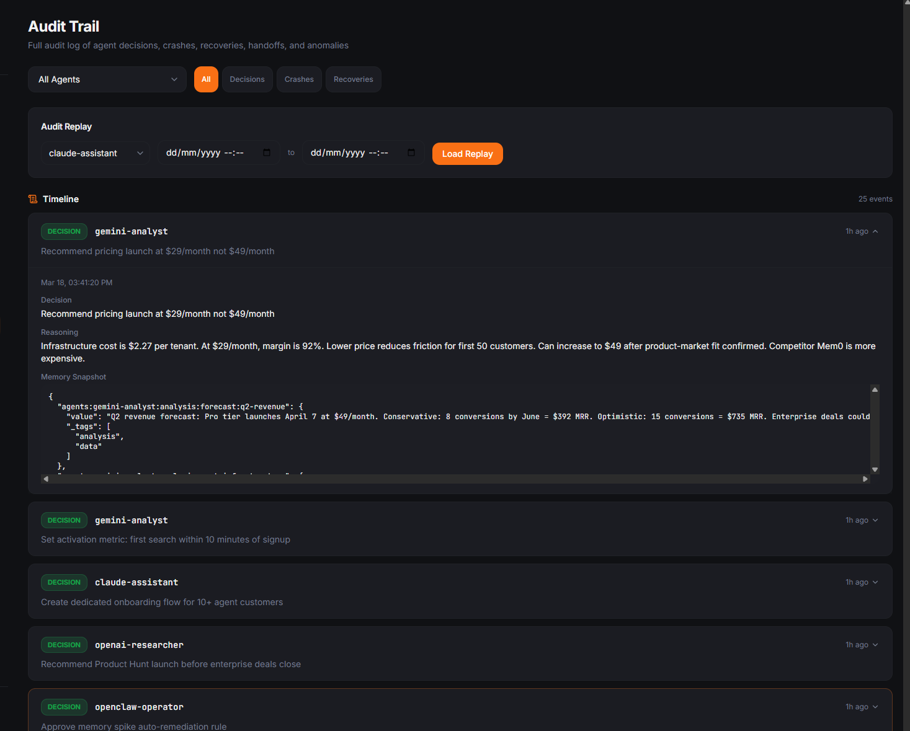
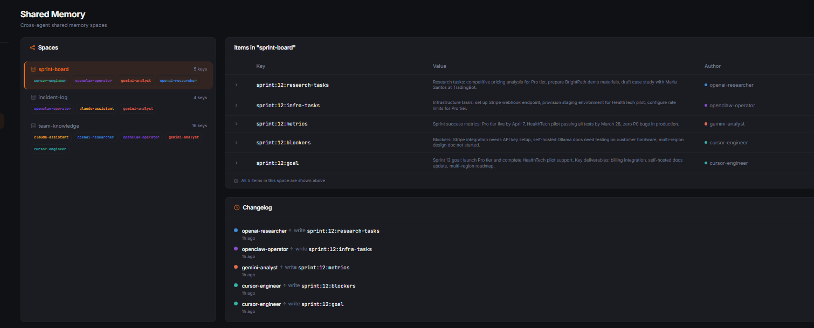

[](https://mseep.ai/app/ryjoxtechnologies-octopoda-os)

<h1 align="center">🐙 Octopoda</h1>

<p align="center">
  <strong>The open-source memory operating system for AI agents.</strong><br />
  Persistent memory · Loop detection · Audit trails · 3D visualization
</p>

<p align="center">
  <a href="https://pypi.org/project/octopoda/"></a>
  <a href="https://pypi.org/project/octopoda/"></a>
  <a href="LICENSE"></a>
  <a href="https://www.python.org/downloads/"></a>
  
  <a href="https://github.com/RyjoxTechnologies/Octopoda-OS/stargazers"></a>
</p>

<p align="center">
  <a href="https://octopodas.com"><b>Website</b></a> ·
  <a href="https://octopodas.com/docs"><b>Docs</b></a> ·
  <a href="https://octopodas.com/dashboard"><b>Dashboard</b></a> ·
  <a href="#quick-start"><b>Quick start</b></a> ·
  <a href="#mcp-server"><b>MCP</b></a>
</p>

<p align="center">
  
</p>

<p align="center"><sub><i>Live 3D view of 5 agents, 294 events, and 98 loops caught — <code>$1.19</code> in wasted tokens detected.</i></sub></p>

---

## Why Octopoda

- **Agents forget.** Every session starts from zero. Octopoda gives them memory that survives restarts, crashes, and deployments — automatically.
- **Agents loop.** A stuck agent can burn hundreds of dollars in tokens before anyone notices. Octopoda's 5-signal loop detector catches it in seconds.
- **Agents are black boxes.** Why did it do that? Octopoda logs every decision, every write, every recovery — and visualizes it in a 3D view so you can actually see what's happening.

---

## Quick Start

```bash
pip install octopoda
```

```python
from octopoda import AgentRuntime

agent = AgentRuntime("my_agent")
```

That's it. Your agent now has persistent memory, loop detection, crash recovery, and an audit trail. Everything runs automatically in the background. Memory survives restarts, crashes, and deployments.

Store and retrieve memories when you need to:

```python
agent.remember("key", "value")
agent.recall("key")
```

Want the dashboard? Run the server:

```bash
pip install octopoda[server]
octopoda
```

Open **http://localhost:7842** — same dashboard as the cloud version, running against your local data. No account needed.

Want cloud sync across machines? Sign up free at [octopodas.com](https://octopodas.com), set your API key, and your agents sync to the cloud automatically:

```bash
export OCTOPODA_API_KEY=sk-octopoda-...
```

Same code, same dashboard — now backed by PostgreSQL with multi-device sync and team access.

---

## Local vs Cloud

| | Local | Cloud |
|---|---|---|
| **Setup** | `pip install octopoda` | Sign up at octopodas.com |
| **Storage** | SQLite on your machine | PostgreSQL + pgvector |
| **Dashboard** | http://localhost:7842 | octopodas.com/dashboard |
| **Account needed** | No | Yes (free) |
| **Data stays on your machine** | Yes | Stored on cloud |
| **Multi-device sync** | No | Yes |
| **Semantic search** | Needs `octopoda[ai]` extra | Built-in |
| **Upgrade path** | Set `OCTOPODA_API_KEY` | Already there |

Start local, upgrade to cloud when you need sync or team access. Both use the same API, same dashboard design, same code.

---

## What You Get Out of the Box

When you create an `AgentRuntime`, all of this is handled for you automatically:

- **Persistent memory** — everything your agent stores survives restarts and crashes
- **Loop detection** — catches agents stuck in repetitive patterns before they burn tokens
- **Audit trail** — every decision, every write, every action is logged
- **Crash recovery** — automatic heartbeat monitoring with snapshot/restore
- **Health scoring** — continuous monitoring of memory quality and agent performance
- **Heartbeats** — background thread tracks agent liveness

You don't need to configure any of this. It just works.

---

## Dashboards

Track latency, error rates, memory usage, and health scores per agent.


Browse every memory, inspect version history, and see exactly how an agent's knowledge changed over time.


---

## Audit Trail

Every decision, crash, recovery, and anomaly your agents make is logged with full context — including a memory snapshot captured at the moment of decision. Replay any time window and see exactly what each agent knew, decided, and why.



```python
agent.log_decision(
    decision="Keep single VPS instead of Kubernetes",
    reasoning="Current traffic (14k req/day) doesn't justify K8s complexity. VPS handles 100x this load.",
    context={"current_rps": 14000, "threshold_rps": 1000000},
)
```

Every `log_decision` call automatically captures a snapshot of the agent's memory at that instant. The audit timeline shows decisions alongside crashes and recoveries, filterable per agent. Built-in loop detection warns you if a decision repeats a recent one.

---

## Shared Memory

Multiple agents working on the same problem can share knowledge through named memory spaces. Writes are atomic, reads are immediate, and every change is logged with its author — so you always know which agent contributed what.



```python
# Research agent writes a finding into a shared space
research_agent.share("market_size", "$2.1B AI memory market by 2027", space="team-knowledge")

# Any other agent in the same space reads it
result = coding_assistant.read_shared("market_size", space="team-knowledge")
print(result.value)  # "$2.1B AI memory market by 2027"
```

Each space tracks authorship and timestamps for every write. Use `agent.shared_conflicts(space="team-knowledge")` to surface disagreements when multiple agents write to the same key.

---

## When You Need More Control

Everything below is optional. Use it when you need it.

### Semantic Search

Find memories by meaning, not just exact keys.

```python
agent.remember("bio", "Alice is a vegetarian living in London")
results = agent.recall_similar("what does the user eat?")
# Returns the right memory with a similarity score
```

### Agent Messaging

Agents can talk to each other through shared inboxes.

```python
agent_a.send_message("agent_b", "Found a bug in auth", message_type="alert")
messages = agent_b.read_messages(unread_only=True)
```

### Goal Tracking

Set goals and track progress. Integrates with drift detection.

```python
agent.set_goal("Migrate to PostgreSQL", milestones=["Backup", "Schema", "Migrate", "Validate"])
agent.update_progress(milestone_index=0, note="Backup done")
```

### Memory Management

```python
agent.forget("outdated_config")                    # Delete specific memories
agent.forget_stale(max_age_seconds=30*86400)       # Clean up memories older than 30 days
agent.consolidate(dry_run=False)                   # Merge duplicate memories (omit dry_run to preview)
agent.memory_health()                              # Get a health report
```

### Snapshots

```python
agent.snapshot("before_migration")
# ... something goes wrong ...
agent.restore("before_migration")
```

### Export / Import

```python
bundle = agent.export_memories()
new_agent.import_memories(bundle)
```

---

## Framework Integrations

Works with the frameworks you already use. Just swap in Octopoda and your agents get persistent memory.

<details>
<summary><b>LangChain — drop-in conversation memory</b></summary>

```python
from octopoda import LangChainMemory
memory = LangChainMemory("my-chain")
memory.save_context({"input": "I prefer dark mode"}, {"output": "Got it!"})
variables = memory.load_memory_variables({})
```
</details>

<details>
<summary><b>CrewAI — persistent crew findings and task results</b></summary>

```python
from octopoda import CrewAIMemory
crew = CrewAIMemory("research-crew")
crew.store_finding("researcher", "market_size", {"value": "$4.2B"})
finding = crew.get_finding("market_size")
```
</details>

<details>
<summary><b>AutoGen — multi-agent conversation memory</b></summary>

```python
from octopoda import AutoGenMemory
memory = AutoGenMemory("dev-team")
memory.store_message("user_proxy", "assistant", "Research quantum computing")
history = memory.get_conversation_history()
```
</details>

<details>
<summary><b>OpenAI Agents SDK — thread and run persistence</b></summary>

```python
from octopoda import OpenAIAgentsMemory
memory = OpenAIAgentsMemory()
memory.store_thread_state("thread_001", {"messages": [...]})
restored = memory.restore_thread("thread_001")
```
</details>

All integrations work locally (no API key) or with cloud sync (set `OCTOPODA_API_KEY`).

---

## MCP Server

Give Claude, Cursor, or any MCP-compatible AI persistent memory with zero code.

```bash
pip install octopoda[mcp]
```

Add to Claude Code:

```bash
claude mcp add octopoda -s user -e OCTOPODA_API_KEY=sk-octopoda-YOUR_KEY -- python -m synrix_runtime.api.mcp_server
```

Or add to Claude Desktop config (`claude_desktop_config.json`):

```json
{
  "mcpServers": {
    "octopoda": {
      "command": "python",
      "args": ["-m", "synrix_runtime.api.mcp_server"],
      "env": {
        "OCTOPODA_API_KEY": "sk-octopoda-YOUR_KEY"
      }
    }
  }
}
```

28 tools for memory, search, loop detection, goals, messaging, and more.

---

## Cloud

Sign up free at [octopodas.com](https://octopodas.com) for the dashboard, managed hosting, and cloud API.

```bash
export OCTOPODA_API_KEY=sk-octopoda-...
```

Or run `octopoda-login` to sign up from your terminal.

```python
from octopoda import Octopoda

client = Octopoda()
agent = client.agent("my_agent")
agent.write("preference", "dark mode")
results = agent.search("user preferences")
```

| | Free | Pro ($19/mo) | Business ($49/mo) | Scale ($99/mo) |
|---|---|---|---|---|
| Agents | 5 | 25 | 75 | Unlimited |
| Memories | 5,000 | 250,000 | 1,000,000 | 5,000,000 |
| AI extractions | 100 | 10,000 | 50,000 | Unlimited |
| Rate limit | 60 rpm | 300 rpm | 1,000 rpm | 5,000 rpm |
| Dashboard | Yes | Yes | Yes | Yes |

---

## How It Compares

| | Octopoda | Mem0 | Zep | LangChain Memory |
|---|---|---|---|---|
| **Open source** | MIT | Apache 2.0 | Partial (CE) | MIT |
| **Local-first** | Yes (SQLite) | Cloud-first | Cloud-first | In-process |
| **Loop detection** | 5-signal engine | No | No | No |
| **Agent messaging** | Built-in | No | No | No |
| **Audit trail** | Full history | No | No | No |
| **Crash recovery** | Snapshots + restore | N/A | No | No |
| **Shared memory** | Built-in | No | No | No |
| **MCP server** | 28 tools | No | No | No |
| **Semantic search** | Local embeddings | Cloud embeddings | Cloud embeddings | Needs vector DB |
| **Integrations** | LangChain, CrewAI, AutoGen, OpenAI | LangChain | LangChain | Own only |

---

## Installation

```bash
pip install octopoda              # Core — everything you need to get started
pip install octopoda[ai]          # + Local embeddings for semantic search
pip install octopoda[nlp]         # + spaCy for knowledge graph extraction
pip install octopoda[mcp]         # + MCP server for Claude/Cursor
pip install octopoda[all]         # Everything
```

## Configuration

| Variable | Default | Description |
|----------|---------|-------------|
| `OCTOPODA_API_KEY` | | Cloud API key (free at octopodas.com) |
| `OCTOPODA_LLM_PROVIDER` | `none` | LLM for fact extraction: `openai`, `anthropic`, `ollama` |
| `OCTOPODA_OPENAI_API_KEY` | | Your OpenAI key for local fact extraction |
| `OCTOPODA_EMBEDDING_MODEL` | `BAAI/bge-small-en-v1.5` | Local embedding model (33MB, CPU) |
| `SYNRIX_DATA_DIR` | `~/.synrix/data` | Local data directory |

## Contributing

See [CONTRIBUTING.md](CONTRIBUTING.md) for setup instructions and guidelines.

## Security

See [SECURITY.md](SECURITY.md) for reporting vulnerabilities.

## License

MIT — use it however you want. See [LICENSE](LICENSE).

---

Built by [RYJOX Technologies](https://octopodas.com) | [PyPI](https://pypi.org/project/octopoda/) | [Cloud API](https://api.octopodas.com) | [Dashboard](https://octopodas.com/dashboard)
